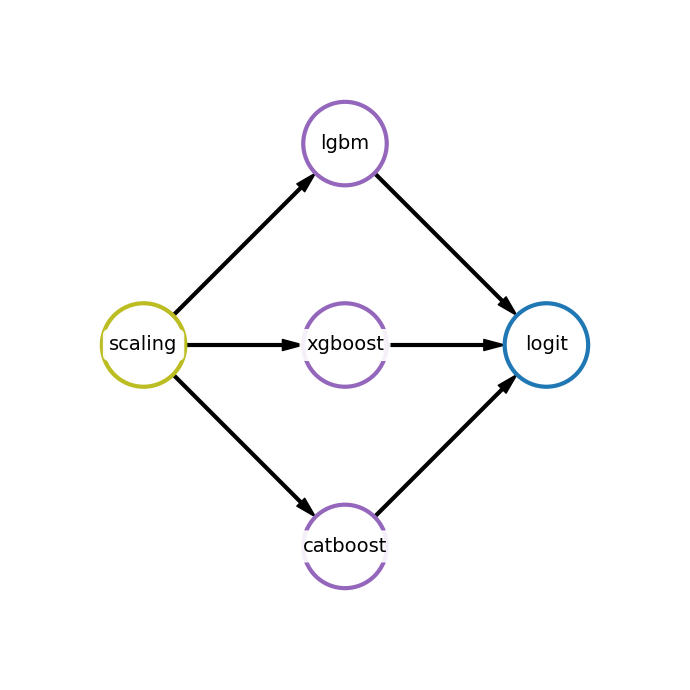
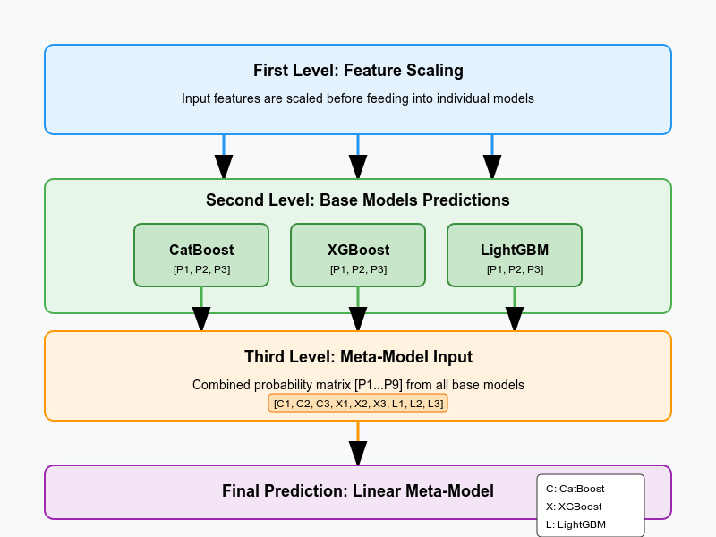

<div align="center">


## Chat with FEDOT docs

</div>

FEDOT is an open-source framework for automated modeling and machine learning (AutoML) problems. This framework is distributed under the 3-Clause BSD license.

It provides automatic generative design of machine learning pipelines for various real-world problems. The core of **FEDOT is based on an evolutionary approach** and supports classification (binary and multiclass), regression, clustering, and time series prediction problems.

[FEDOT Repository](https://github.com/aimclub/FEDOT)

## Link for a Chat Bot

[chat-with-fedot-docs.app](https://chat-with-fedot-docs.streamlit.app/)

## Fork this repo for your own use

1. Go to [https://makersuite.google.com](https://aistudio.google.com/prompts/new_chat?hl=ru)
2. Click on the `+ Create new secret` key button.
3. Use [Streamlit Community Cloud's secrets management feature](https://docs.streamlit.io/deploy/streamlit-community-cloud/deploy-your-app/secrets-management) to add your API key via the web interface. Add the following to it `genai_key=<your key here>`.

***

# FEDOT cheat sheet
[click me to download](https://github.com/dmitryglhf/chat-with-FEDOT-docs/blob/main/fedot-cheatsheet.pdf)

## Quick Start
```python
# Installation
pip install fedot

# Basic usage example
from fedot.api.main import Fedot
model = Fedot(problem='classification')
model.fit(features=X_train, target=y_train)
prediction = model.predict(features=X_test)
```

## Configuration Options
```python
from fedot.api.main import Fedot
from fedot.core.pipelines.pipeline_builder import PipelineBuilder


# Configuring FEDOT
model = Fedot(
    problem='classification',
    preset='best_quality',  # Options: 'fast', 'stable', 'best_quality', etc.
    timeout=5,  # Minutes for optimization
    with_tuning=True,  # Allow tuning mode
    n_jobs=-1,  # CPU cores to use (-1 = all)
    cv_folds=5,  # Cross-validation folds
    seed=42,  # Random seed
    metric=["accuracy"],  # Set metrics to optimize
    initial_assumption=PipelineBuilder() \
    .add_node('catboost', params={"iterations": 10000}).build(),  # Set new initial assumption
)

```

## FEDOT Built-in Data Class
Using the built-in data class in FEDOT provides several key benefits:

✅ **Consistent Interface**  
  Simplifies interaction between models and data with a unified, well-tested structure.

✅ **Convenient Utilities**  
  Includes ready-to-use methods like `train_test_split` for easier data processing.

✅ **Fewer Errors**  
  Reduces the chances of mistakes during data loading and preparation.

Code examples:

```python
from fedot.core.data.data import InputData
from fedot.core.repository.tasks import Task, TaskTypesEnum
from fedot.core.repository.dataset_types import DataTypesEnum
from fedot.core.data.data_split import train_test_data_setup


# from scratch
data = InputData(
    idx=np.arange(0, len(X)),
    features=X,
    target=y.values,
    data_type=DataTypesEnum.table,
    task=Task(TaskTypesEnum.classification)
)

# from dataframe
data_from_df = InputData.from_dataframe(
    features_df=X,
    target_df=y,
    task=Task(TaskTypesEnum.classification)
)

# from .csv
data_path = 'path_to_data'
data_from_csv = InputData.from_csv(
    data_path,
    target_columns='target',
    task=Task(TaskTypesEnum.classification)
)

# from numpy
data_from_np = InputData.from_numpy(
    features_array,
    target_array,
    task=Task(TaskTypesEnum.classification)
)

# how to use it:
train, test = train_test_data_setup(data)
model = Fedot(problem='classification')
model.fit(train)
predictions = model.predict(features=test)
```

## Core Concepts
- **Pipelines**: Computational graphs that combine data operations and models
- **Nodes**: Individual operations within a pipeline (preprocessing or models)
- **Edges**: Connections between nodes that define data flow
- **Composer**: Algorithm that creates pipeline structures
- **Tuner**: Optimizes hyperparameters of models in a pipeline

## How does FEDOT pipeline works:

For example we had pipeline like this:



How Prediction Works:

1. **First Level:** Initially, feature scaling is performed before feeding the data into each of the nodes.
2. **Second Level:** Each node sequentially predicts class probabilities. For example, in the [s4e6 Kaggle task](https://www.kaggle.com/competitions/playground-series-s4e6/overview), there are three classes. Since there are three models at this level, the output is a matrix with nine columns (three probabilities for each model). The first three columns represent class probabilities from CatBoost, the next three are probabilities from XGBoost, and the final three columns are probabilities from LightGBM.
3. **Third Level:** At this stage, the data passed to the linear model (acting as a meta-model) consists of the predictions from each boosting model, rather than the original features.
4. **Final Prediction:** The linear model, as the meta-model, makes the final prediction based on the predictions of the previous models.

You can image it like this:



## Common Methods

### Automatic Pipeline Construction
| Method | Description | Example |
|--------|-------------|---------|
| `Fedot()` | Initialize the framework | `model = Fedot(problem='regression')` |
| `fit()` | Train the model | `model.fit(features=X, target=y)` |
| `predict()` | Make predictions | `predictions = model.predict(features=X_test)` |
| `predict_proba()` | Predict probabilities | `probas = model.predict_proba(features=X_test)` |
| `save()` | Save the model | `model.save('model.pkl')` |
| `load()` | Load a saved model | `model = Fedot.load('model.pkl')` |
| `get_metrics()` | Print a metrics | `model.get_metrics(y_test)` |

### Manual Pipeline Construction
| Method | Description | Example |
|--------|-------------|---------|
| `Pipeline()` | Create empty pipeline | `pipeline = Pipeline()` |
| `Node()` | Create operation node | `node = Node(operation_type='xgboost')` |
| `add_node()` | Add node to pipeline | `pipeline.add_node(node)` |
| `add_edge()` | Connect nodes | `pipeline.add_edge(node_from, node_to)` |
| `fit()` | Train pipeline | `pipeline.fit(input_data=train_data)` |
| `predict()` | Get predictions | `predictions = pipeline.predict(input_data=test_data)` |

Finally, you should `.build()` pipeline to use it as model. For example:
```python
pipeline = PipelineBuilder().add_node('scaling').add_node('xgboost').build()
```
Also, you can plot your custom pipeline:
```python
pipeline.show()
```
Note: It's not necessary to specify actual model names when visualizing a pipeline. You can use PipelineBuilder() as a visualization tool by providing any descriptive text in place of real models. However, keep in mind that such a pipeline is intended for illustrative purposes only and will not function as a working machine learning pipeline. For example:
```python
PipelineBuilder().add_node('First node').add_node('Second node!').build().show()
```

## Available Models and Operations

### Operaion Nodes (Data Processing)
- `scaling` - Feature scaling
- `normalization` - Feature normalization
- `pca` - Principal Component Analysis
- `kernel_pca` - Kernel PCA
- `fast_ica` - Independent Component Analysis
- `polynomial_features` - Polynomial feature generation
- `lagged` - Time series lagged features
- `smoothing` - Time series smoothing
- etc.

### Model Nodes (Models)
- `linear` - Linear models
- `ridge` - Ridge regression
- `lasso` - Lasso regression
- `rf` - Random Forest
- `xgboost` - XGBoost
- `lgbm` - LightGBM
- `catboost` - CatBoost
- `knn` - K-Nearest Neighbors
- etc.

## Troubleshooting

| Issue | Solution |
|-------|----------|
| `MemoryError` during pipeline optimization | Reduce `pop_size` and `num_of_generations` parameters |
| Poor performance on time series | Add lagged features with `lagged` operation nodes |
| Slow execution | Set `preset='fast'` or reduce optimization parameters |
| Overfitting on small datasets | Use cross-validation (`cv_folds` parameter) or simpler pipelines |
| Model not improving | Try different `metric` values or increase optimization time |

## Resources
- [Official Documentation](https://fedot.readthedocs.io/)
- [GitHub Repository](https://github.com/aimclub/FEDOT)
- [Examples](https://github.com/ITMO-NSS-team/fedot-examples)
